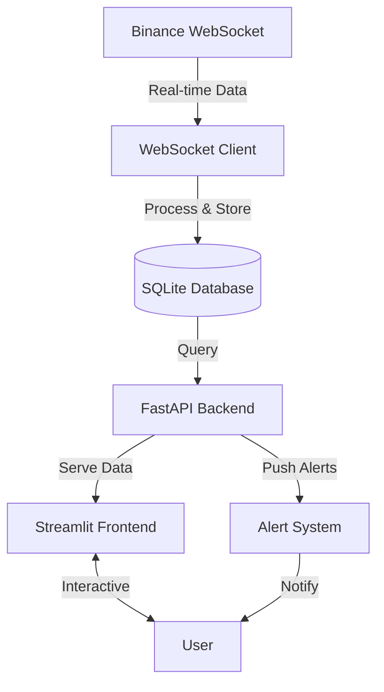

# Trading Analytics Platform

A real-time trading analytics platform that ingests market data from Binance, processes it, and provides interactive visualizations and alerts.

## Features

- **Real-time Data Ingestion**: Connects to Binance WebSocket API for live market data
- **Data Processing**: Resamples tick data to various timeframes (1s, 1m, 5m, 15m, 1h, 4h, 1d)
- **Analytics**: Computes various metrics including:
  - Price statistics (OHLCV)
  - Volatility
  - Z-scores
  - Correlation between pairs
  - Spread analysis
  - Hedge ratios
- **Alerts**: Set up custom price and metric-based alerts
- **Interactive Dashboard**: Streamlit-based UI with real-time updates
- **REST API**: FastAPI backend for data access and control

## Architecture



## Prerequisites

- Python 3.8+
- pip (Python package manager)
- Node.js and npm (for frontend development, optional)

## Installation

1. Clone the repository:
   ```bash
   git clone https://github.com/yourusername/trading-analytics.git
   cd trading-analytics
   ```

2. Create and activate a virtual environment (recommended):
   ```bash
   python -m venv venv
   source venv/bin/activate  # On Windows: venv\Scripts\activate
   ```

3. Install the required packages:
   ```bash
   pip install -r requirements.txt
   ```

## Configuration

1. Create a `.env` file in the project root with the following variables:
   ```
   # Binance API (optional, only needed for private endpoints)
   BINANCE_API_KEY=your_api_key
   BINANCE_API_SECRET=your_api_secret
   
   # Application settings
   DEBUG=True
   ```

## Running the Application

### Backend API Server

```bash
# Start the FastAPI server with hot-reload
uvicorn backend.main:app --reload --host 0.0.0.0 --port 8000
```

The API will be available at `http://localhost:8000`

### Frontend Dashboard

```bash
# Start the Streamlit dashboard
streamlit run frontend/app.py
```

The dashboard will be available at `http://localhost:8501`

## Project Structure

```
trading-analytics/
├── backend/                  # FastAPI backend
│   ├── api/                  # API routes
│   ├── data_ingestion/       # WebSocket client and data processing
│   ├── database/             # Database models and manager
│   ├── config.py             # Application configuration
│   └── main.py               # FastAPI application
├── frontend/                 # Streamlit frontend
│   ├── app.py                # Main dashboard application
│   └── components/           # Reusable UI components
├── tests/                    # Unit and integration tests
├── data/                     # Database and other data files
├── requirements.txt          # Python dependencies
└── README.md                 # This file
```

## API Endpoints

### Data Endpoints

- `GET /api/symbols` - List all available symbols
- `GET /api/ticks/{symbol}` - Get tick data for a symbol
- `GET /api/ohlcv/{symbol}` - Get OHLCV data for a symbol
- `GET /api/analytics/{symbol1}` - Get analytics for a symbol or symbol pair
- `GET /api/export/csv` - Export data as CSV

### Alert Endpoints

- `GET /api/alerts` - List all alerts
- `POST /api/alerts` - Create a new alert
- `PUT /api/alerts/{alert_id}/trigger` - Trigger an alert
- `DELETE /api/alerts/{alert_id}` - Delete an alert

## Development

### Running Tests

```bash
pytest
```

### Code Style

This project uses:
- Black for code formatting
- isort for import sorting
- flake8 for linting

Run the following commands to ensure code quality:

```bash
black .
isort .
flake8
```

## Deployment

### Docker

A `Dockerfile` and `docker-compose.yml` are provided for containerized deployment:

```bash
docker-compose up --build
```

### Cloud Deployment

The application can be deployed to any cloud provider that supports containerized applications, such as:
- AWS ECS/EKS
- Google Cloud Run
- Azure Container Instances
- Heroku

## License

This project is licensed under the MIT License - see the [LICENSE](LICENSE) file for details.

## Acknowledgments

- [Binance](https://www.binance.com/) for the market data API
- [FastAPI](https://fastapi.tiangolo.com/) for the backend framework
- [Streamlit](https://streamlit.io/) for the dashboard
- [Plotly](https://plotly.com/) for interactive visualizations
